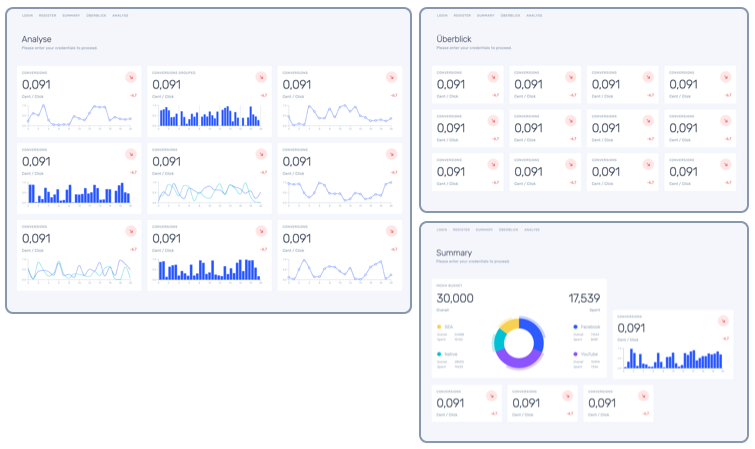
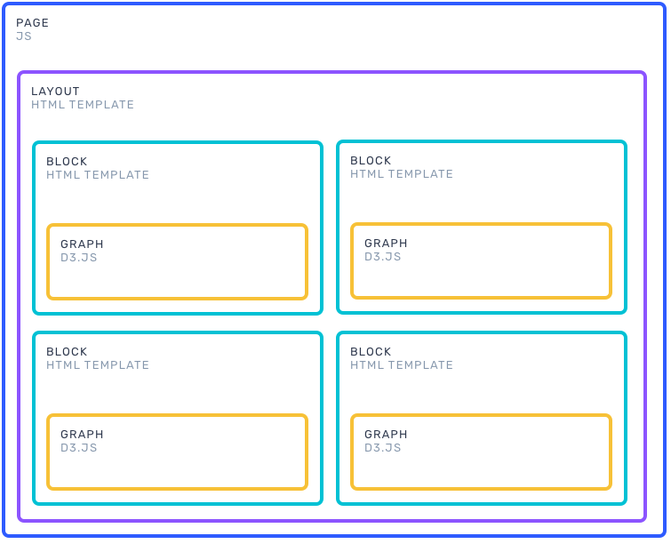
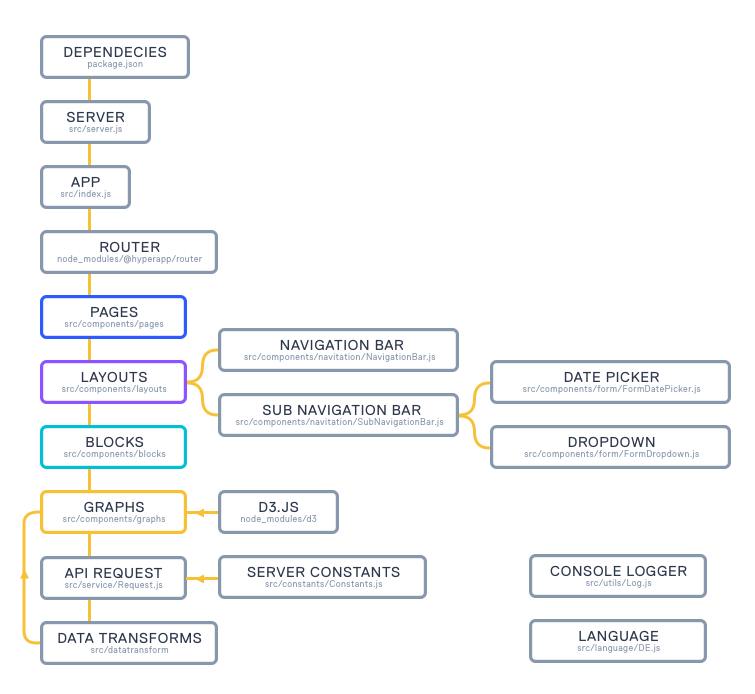

# Data Dashboard

Modular Marketing Dashboard Web Application Front-End<br/>
Stack: ES6/d3.js/Hyperapp.js/Picostyle/Parcel




## Install

Install with [npm](https://www.npmjs.com/):

```sh
$ sudo npm install
```


## Running

Before running install [parcel] (https://parceljs.org/)</br>
Start server:

```sh
$ sudo npm start
```


## Deploying

Clone Repository:

```sh
$ git clone <repo>
```

Start server:

```sh
$ sudo npm start
```

## Dependencies

[D3.JS] - Chart drawing:<br/>
          Line Chart<br/>
          Bar Chart<br/>
          Pie Chart<br/>
          Force Graph<br/><br/>

[HYPERAPP.JS] - Framework<br/><br/>

[PARCEL.JS] (https://parceljs.org/) - Bundler<br/><br/>

## Architecture

APP ← PAGE ← LAYOUT ← BLOCK ← GRAPH <br/><br/>



<br/>



<br/>


## Author

Darek Nyckowiak<br/>
darek@nyckowiak.com
